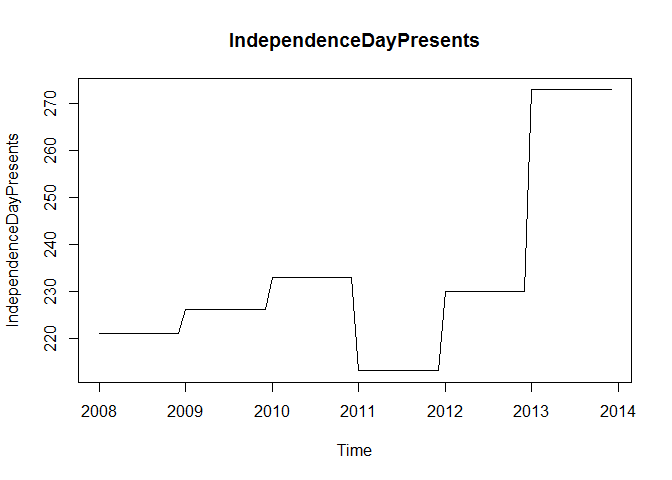

# Case Study 2 6306_403
Mike Martos  
July 17, 2016  


```r
#Import data
ImportedAsIsData <- read.csv("./Data/Raw/ImportedAsIsDataChulwalar.csv", header = F, sep=";", fill = T) 
ImportedPlanData <- read.csv("./Data/Raw/ImportedPlanDataChulwalar.csv", header = F, sep=";", fill = T) 
ImportedIndicators <- read.csv("./Data/Raw/ImportedIndicatorsChulwalar.csv", header = F, sep=";", fill = T) 
```


### The time series can be analysed using the stl function in order to seperate
### the trend, seasonality and remainder .
<!-- -->

###The following indicators show good correlation

```r
# Monthly Change in Export Price Index (CEPI)
CEPIVector <- c(ImportedIndicators[2:13,2],ImportedIndicators[2:13,3],ImportedIndicators[2:13,4],ImportedIndicators[2:13,5],ImportedIndicators[2:13,6],ImportedIndicators[2:13,7])
CEPI <- ts(CEPIVector , start=c(2008,1), end=c(2013,12), frequency=12)
plot(CEPI, main="CEPI")
```

<!-- -->

```r
cor(EfakAsIs , CEPI)
```

```
## [1] 0.9303543
```

```r
#Very good correlation with CEPI index continuous upward trend.

# Yearly exports from Urbano
UrbanoExportsVector <- c(ImportedIndicators[72:83,2],ImportedIndicators[72:83,3],ImportedIndicators[72:83,4],ImportedIndicators[72:83,5],ImportedIndicators[72:83,6],ImportedIndicators[72:83,7])
UrbanoExports <- ts(UrbanoExportsVector, start=c(2008,1), end=c(2013,12), frequency=12)
plot(UrbanoExports, main="UrbanoExports")
```

<!-- -->

```r
cor(EfakAsIs , UrbanoExports)
```

```
## [1] 0.9163565
```

```r
#Very good correlation because of the upward trend probably

# Monthly Average Export Price Index for Chulwalar
AEPIVector <- c(ImportedIndicators[100:111,2],ImportedIndicators[100:111,3],ImportedIndicators[100:111,4],ImportedIndicators[100:111,5],ImportedIndicators[100:111,6],ImportedIndicators[100:111,7])
AEPI <- ts(AEPIVector, start=c(2008,1), end=c(2013,12), frequency=12)
plot(AEPI, main="AEPI")
```

<!-- -->

```r
cor(EfakAsIs , AEPI)
```

```
## [1] 0.9056624
```

```r
#Very good correlation with AEPI particularly towards the last two thirds of the graph.

# Yearly number of Globalisation Party members in Chulwalar
GlobalisationPartyMembersVector <- c(ImportedIndicators[86:97,2],ImportedIndicators[86:97,3],ImportedIndicators[86:97,4],ImportedIndicators[86:97,5],ImportedIndicators[86:97,6],ImportedIndicators[86:97,7])
GlobalisationPartyMembers <- ts(GlobalisationPartyMembersVector, start=c(2008,1), end=c(2013,12), frequency=12)
plot(GlobalisationPartyMembers, main="GlobalisationPartyMembers")
```

<!-- -->

```r
cor(EfakAsIs , GlobalisationPartyMembers)
```

```
## [1] 0.8963942
```

```r
#The trend makes the correlation pretty good, it shows a bit of a flat trend towards 
#the last three years of the graph

# Monthly Satisfaction Index (SI) external index 
SIExternVector <- c(ImportedIndicators[58:69,2],ImportedIndicators[58:69,3],ImportedIndicators[58:69,4],ImportedIndicators[58:69,5],ImportedIndicators[58:69,6],ImportedIndicators[58:69,7])
SIExtern <- ts(SIExternVector, start=c(2008,1), end=c(2013,12), frequency=12)
plot(SIExtern, main="SIExtern")
```

<!-- -->

```r
cor(EfakAsIs , SIExtern) 
```

```
## [1] 0.8358147
```

```r
#The correlation is good which might be explained by the upward trend
```

###The following indicators didn't do as well as the previous ones

```r
#######################################################################################
# The External Satisfaction Index indicator is to be offset by one month, to see if the 
# index change makes itself first noticeable on exports in the following months.
#######################################################################################
SIExternOffsetByOneMonthVector <- c(ImportedIndicators[59:69,2],ImportedIndicators[58:69,3],ImportedIndicators[58:69,4],ImportedIndicators[58:69,5],ImportedIndicators[58:69,6],ImportedIndicators[58:69,7])
SIExternOffsetByOneMonth <- ts(SIExternOffsetByOneMonthVector, start=c(2008,1), end=c(2013,11), frequency=12)
plot(SIExternOffsetByOneMonth, main="SIExternOffsetByOneMonth")
```

<!-- -->

```r
# Delete December 2013 from the ts 
EfakAsIsWithoutDec12013 <- ts(EfakAsIsVector , start=c(2008,1), end=c(2013,11), frequency=12)

cor(EfakAsIsWithoutDec12013, SIExternOffsetByOneMonth)
```

```
## [1] 0.827721
```

```r
#Still not very good

# Chulwalar Index (Total value of all companies in Chulwalar)
ChulwalarIndexVector <- c(ImportedIndicators[128:139,2],ImportedIndicators[128:139,3],ImportedIndicators[128:139,4],ImportedIndicators[128:139,5],ImportedIndicators[128:139,6],ImportedIndicators[128:139,7])
ChulwalarIndex <- ts(ChulwalarIndexVector, start=c(2008,1), end=c(2013,12), frequency=12)
plot(ChulwalarIndex, main="ChulwalarIndex")
```

<!-- -->

```r
cor(EfakAsIs , ChulwalarIndex) 
```

```
## [1] 0.7129557
```

```r
#The correlation here is not too bad

# Monthly Producer Price Index (PPI) for Etel in Chulwalar
PPIEtelVector <- c(ImportedIndicators[114:125,2],ImportedIndicators[114:125,3],ImportedIndicators[114:125,4],ImportedIndicators[114:125,5],ImportedIndicators[114:125,6],ImportedIndicators[114:125,7])
PPIEtel <- ts(PPIEtelVector, start=c(2008,1), end=c(2013,12), frequency=12)
plot(PPIEtel, main="PPIEtel")
```

<!-- -->

```r
cor(EfakAsIs , PPIEtel) 
```

```
## [1] 0.5865375
```

```r
#Not a very good correlation it even seems to flatten in the last couple of years.

# Proposed spending for Independence day presents
IndependenceDayPresentsVector <- c(ImportedIndicators[156:167,2],ImportedIndicators[156:167,3],ImportedIndicators[156:167,4],ImportedIndicators[156:167,5],ImportedIndicators[156:167,6],ImportedIndicators[156:167,7])
IndependenceDayPresents <- ts(IndependenceDayPresentsVector, start=c(2008,1), end=c(2013,12), frequency=12)
plot(IndependenceDayPresents, main="IndependenceDayPresents")
```

<!-- -->

```r
cor(EfakAsIs , IndependenceDayPresents) 
```

```
## [1] 0.5243145
```

```r
#Not a good correlation with independece days presents, which seems to be odd.

# Monthly Satisfaction Index (SI) government based data
SIGovVector <- c(ImportedIndicators[16:27,2],ImportedIndicators[16:27,3],ImportedIndicators[16:27,4],ImportedIndicators[16:27,5],ImportedIndicators[16:27,6],ImportedIndicators[16:27,7])
SIGov <- ts(SIGovVector , start=c(2008,1), end=c(2013,12), frequency=12)
plot(SIGov, main="SIGov")
```

<!-- -->

```r
cor(EfakAsIs , SIGov)
```

```
## [1] 0.37934
```

```r
#Bad correlation with Efak exports, they even have different trends, perhaps
#just the last year might correlate better but it might be just a smaller 
#cycle before it returns to what it showed previously

# Monthly Inflation rate in Chulwalar 
InflationVector <- c(ImportedIndicators[142:153,2],ImportedIndicators[142:153,3],ImportedIndicators[142:153,4],ImportedIndicators[142:153,5],ImportedIndicators[142:153,6],ImportedIndicators[142:153,7])
Inflation <- ts(InflationVector, start=c(2008,1), end=c(2013,12), frequency=12)
plot(Inflation, main="Inflation")
```

<!-- -->

```r
cor(EfakAsIs , Inflation) 
```

```
## [1] 0.1454134
```

```r
#Not a good correlation with the inflation index

# orignial National Holidays indicator.    
InfluenceNationalHolidaysVector <- c(ImportedIndicators[184:195,2],ImportedIndicators[184:195,3],ImportedIndicators[184:195,4],ImportedIndicators[184:195,5],ImportedIndicators[184:195,6],ImportedIndicators[184:195,7])
InfluenceNationalHolidays <- ts(InfluenceNationalHolidaysVector, start=c(2008,1), end=c(2013,12), frequency=12)
plot(InfluenceNationalHolidays, main="InfluenceNationalHolidays")
```

<!-- -->

```r
cor(EfakAsIs , InfluenceNationalHolidays) 
```

```
## [1] 0.09926836
```

```r
#Bad correlation with this index as well

# National Holidays
NationalHolidaysVector <- c(ImportedIndicators[170:181,2],ImportedIndicators[170:181,3],ImportedIndicators[170:181,4],ImportedIndicators[170:181,5],ImportedIndicators[170:181,6],ImportedIndicators[170:181,7])
NationalHolidays <- ts(NationalHolidaysVector, start=c(2008,1), end=c(2013,12), frequency=12)
plot(NationalHolidays, main="NationalHolidays")
```

<!-- -->

```r
cor(EfakAsIs , NationalHolidays) 
```

```
## [1] 0.001235706
```

```r
#Not very good correlation with National holidays, whish seems odd as Efak flowers should be a 
#preferred present during the festivities.

# Average monthly temperatures in Chulwalar
TemperatureVector <- c(ImportedIndicators[30:41,2],ImportedIndicators[30:41,3],ImportedIndicators[30:41,4],ImportedIndicators[30:41,5],ImportedIndicators[30:41,6],ImportedIndicators[30:41,7])
Temperature <- ts(TemperatureVector, start=c(2008,1), end=c(2013,12), frequency=12)
plot(Temperature, main="Temperature")
```

<!-- -->

```r
cor(EfakAsIs , Temperature) 
```

```
## [1] -0.07951179
```

```r
#Very bad correlation, with higher temperatures in the middle of the year, as chulwalar is 
#in the northern hemisphere.

# Monthly births in Chulwalar 
BirthsVector <- c(ImportedIndicators[44:55,2],ImportedIndicators[44:55,3],ImportedIndicators[44:55,4],ImportedIndicators[44:55,5],ImportedIndicators[44:55,6],ImportedIndicators[44:55,7])
Births <- ts(BirthsVector, start=c(2008,1), end=c(2013,12), frequency=12)
plot(Births, main="Births")
```

<!-- -->

```r
cor(EfakAsIs , Births) 
```

```
## [1] -0.05802961
```

```r
#Births are seasonal as well with higher numbers of them during the summer months. 
#Correlation with Efak exports is not good
```


###Since we have data for 2014 on the Total As Is column, we wanted to find the correlation

```r
plot(TotalAsIsVector, main="TotalAsIsVector")
```

<!-- -->

```r
#Since we have As Is data all the way to 2014, I wanted to check if correlation was good.
cor(EfakAsIsVector, TotalAsIsVector)  
```

```
## [1] 0.7720875
```

###UrbanoExportsVector, GlobalisationPartyMembersVector, ChulwalarIndexVector, these are the ones I found in the correlation section, the three had very good correlation to Efak and had data all the way to 2014, that is why I prefer these.

```r
####Urbano
usingurbano <- tslm(EfakAsIs ~ trend + season + UrbanoExports)
tslmUrbano <- forecast(usingurbano, newdata = UrbanoExports_2014, h=12)
```

```
## Warning in forecast.lm(usingurbano, newdata = UrbanoExports_2014, h = 12):
## newdata column names not specified, defaulting to first variable required.
```

```r
#Start capturing the quality
quality <- accuracy(tslmUrbano)
Model <- "TrendSeasonUrbano"
quality <- cbind(Model, quality)
names(quality) <- c("ME","RMSE","MAE","MPE","MAPE","MASE","ACF1","MODEL")

####Globalization
usingGlobalisationPartyMembers <- tslm(EfakAsIs ~ trend + season + GlobalisationPartyMembers)
tslmGlobalization <- forecast(usingGlobalisationPartyMembers, newdata = GlobalisationPartyMembers_2014, h=12)
```

```
## Warning in forecast.lm(usingGlobalisationPartyMembers, newdata =
## GlobalisationPartyMembers_2014, : newdata column names not specified,
## defaulting to first variable required.
```

```r
quality <- rbind(quality, c("TrendSeasonGlobalParty", accuracy(tslmGlobalization)))

####ChulwalarIndex
usingChulwalarIndex <- tslm(EfakAsIs ~ trend + season + ChulwalarIndex)
tslmChulwalarIdx <- forecast(usingChulwalarIndex, newdata = ChulwalarIndex_2014, h=12)
```

```
## Warning in forecast.lm(usingChulwalarIndex, newdata =
## ChulwalarIndex_2014, : newdata column names not specified, defaulting to
## first variable required.
```

```r
quality <- rbind(quality, c("TrendSeasonChulwalarIdx", accuracy(tslmChulwalarIdx)))

#Indicators that have data for 2014
indicators2014 <- tslm(EfakAsIs ~ trend + season + UrbanoExports + GlobalisationPartyMembers + ChulwalarIndex + Inflation + InfluenceNationalHolidays + IndependenceDayPresents + NationalHolidays)
tslmAll2014 <- forecast(indicators2014, newdata =data.frame(UrbanoExports=UrbanoExports_2014, GlobalisationPartyMembers=GlobalisationPartyMembers_2014,ChulwalarIndex=ChulwalarIndex_2014,Inflation=Inflation_2014,InfluenceNationalHolidays=InfluenceNationalHolidays_2014,IndependenceDayPresents=IndependenceDayPresents_2014,NationalHolidays=NationalHolidays_2014) , h=12)
```

```
## Warning in predict.lm(object, newdata = newdata, se.fit = TRUE, interval =
## "prediction", : prediction from a rank-deficient fit may be misleading
```

```
## Warning in predict.lm(object, newdata = newdata, se.fit = TRUE, interval =
## "prediction", : prediction from a rank-deficient fit may be misleading
```

```r
quality <- rbind(quality, c("TrendSeasonAllIndicators2014", accuracy(tslmAll2014)))


#No indicators just seasonality and trend
NoIndicators <- tslm(EfakAsIs ~ trend + season)
tslmSeasonTrend <- forecast(NoIndicators,h=12)
quality <- rbind(quality, c("tslmSeasonTrend", accuracy(tslmSeasonTrend)))
```

###Exponential smoothing forecast, Ses forcast model

```r
Model_ses <- ses(EfakAsIs, h=12)
quality <- rbind(quality, c("Model_ses", accuracy(Model_ses)))
```

###Exponential smoothing forecast, Testing the Holt forecast models

```r
Model_holt_1 <- holt(EfakAsIs,h=12)
quality <- rbind(quality, c("Model_holt_1", accuracy(Model_holt_1)))

Model_holt_2<- holt(EfakAsIs, exponential=TRUE,h=12)
quality <- rbind(quality, c("Model_holt_2", accuracy(Model_holt_2)))

# With damp = TRUE
Model_holt_3 <- holt(EfakAsIs, damped=TRUE,h=12)
quality <- rbind(quality, c("Model_holt_3", accuracy(Model_holt_3)))

#Damp and Explotential
Model_holt_4 <- holt(EfakAsIs, exponential=TRUE, damped=TRUE,h=12)
quality <- rbind(quality, c("Model_holt_4", accuracy(Model_holt_4)))
```

###Exponential smoothing forecast, Holt Winters model

```r
#Additive
Model_hw_1 <- hw(EfakAsIs ,seasonal="additive",h=12)
quality <- rbind(quality, c("Model_hw_1", accuracy(Model_hw_1)))

#Multiplicative
Model_hw_2 <- hw(EfakAsIs ,seasonal="multiplicative",h=12)
quality <- rbind(quality, c("Model_hw_2", accuracy(Model_hw_2)))
```
###Exponential smoothing state space model

```r
#ets model
Model_ets <- ets(EfakAsIs, model="ZZZ", damped=NULL, alpha=NULL, beta=NULL, gamma=NULL, phi=NULL, additive.only=FALSE, lambda=NULL, lower=c(rep(0.0001,3), 0.8), upper=c(rep(0.9999,3),0.98), opt.crit=c("lik","amse","mse","sigma","mae"), nmse=3, bounds=c("both","usual","admissible"), ic=c("aicc","aic","bic"), restrict=TRUE)

Model_ets_forecast <- forecast(Model_ets,h=12)
quality <- rbind(quality, c("Model_ets_forecast", accuracy(Model_ets_forecast)))
```

###Fit ARIMA model to univariate time series

```r
Model_ARIMA_1  <- Arima(EfakAsIs, order=c(0,1,0))
quality <- rbind(quality, c("Model_ARIMA_1", accuracy(forecast(Model_ARIMA_1))))

Model_ARIMA_2 <- Arima(EfakAsIs, order=c(1,1,0))
quality <- rbind(quality, c("Model_ARIMA_2", accuracy(forecast(Model_ARIMA_2))))


Model_ARIMA_3 <- Arima(EfakAsIs, order=c(1,1,1))
quality <- rbind(quality, c("Model_ARIMA_3", accuracy(forecast(Model_ARIMA_3))))

Model_ARIMA_4 <- Arima(EfakAsIs, order=c(2,1,1))
quality <- rbind(quality, c("Model_ARIMA_4", accuracy(forecast(Model_ARIMA_4))))

Model_ARIMA_5 <- Arima(EfakAsIs, order=c(2,1,2))
quality <- rbind(quality, c("Model_ARIMA_5", accuracy(forecast(Model_ARIMA_5))))

Model_ARIMA_6 <- Arima(EfakAsIs, order=c(3,1,2))
quality <- rbind(quality, c("Model_ARIMA_6", accuracy(forecast(Model_ARIMA_6))))

Model_ARIMA_7 <- Arima(EfakAsIs, order=c(3,1,3))
quality <- rbind(quality, c("Model_ARIMA_7", accuracy(forecast(Model_ARIMA_7))))

Model_ARIMA_8 <- Arima(EfakAsIs, order=c(3,1,1))
quality <- rbind(quality, c("Model_ARIMA_8", accuracy(forecast(Model_ARIMA_8))))

Model_ARIMA_9 <- Arima(EfakAsIs, order=c(3,1,2))
quality <- rbind(quality, c("Model_ARIMA_9", accuracy(forecast(Model_ARIMA_9))))

Model_ARIMA_10 <- Arima(EfakAsIs, order=c(1,1,3))
quality <- rbind(quality, c("Model_ARIMA_10", accuracy(forecast(Model_ARIMA_10))))

Model_ARIMA_11 <- Arima(EfakAsIs, order=c(2,1,3))
quality <- rbind(quality, c("Model_ARIMA_11", accuracy(forecast(Model_ARIMA_11))))

Model_ARIMA_12 <- Arima(EfakAsIs, order=c(2,2,3))
quality <- rbind(quality, c("Model_ARIMA_12", accuracy(forecast(Model_ARIMA_12))))

Model_ARIMA_13 <- Arima(EfakAsIs, order=c(2,3,2))
quality <- rbind(quality, c("Model_ARIMA_13", accuracy(forecast(Model_ARIMA_13))))

# Seasonal ARIMA modelling   				                                    

Model_Seasonal_ARIMA_0 <- Arima(EfakAsIs, order=c(0,0,0), seasonal=c(1,0,0))
quality <- rbind(quality, c("Model_Seasonal_ARIMA_0", accuracy(forecast(Model_Seasonal_ARIMA_0))))


Model_Seasonal_ARIMA_1 <- Arima(EfakAsIs, order=c(0,1,1), seasonal=c(0,1,1))
quality <- rbind(quality, c("Model_Seasonal_ARIMA_1", accuracy(forecast(Model_Seasonal_ARIMA_1))))

Model_Seasonal_ARIMA_2 <- Arima(EfakAsIs, order=c(2,3,2), seasonal=c(1,1,1))
quality <- rbind(quality, c("Model_Seasonal_ARIMA_2", accuracy(forecast(Model_Seasonal_ARIMA_2))))

# Good results when using drift.
Model_Seasonal_ARIMA_3 <- Arima(EfakAsIs, order=c(1,0,1), seasonal=c(1,1,1),include.drift=TRUE)
quality <- rbind(quality, c("Model_Seasonal_ARIMA_3", accuracy(forecast(Model_Seasonal_ARIMA_3))))

Model_Seasonal_ARIMA_4 <- Arima(EfakAsIs, order=c(2,3,2), seasonal=c(1,3,2))
quality <- rbind(quality, c("Model_Seasonal_ARIMA_4", accuracy(forecast(Model_Seasonal_ARIMA_4))))

Model_Seasonal_ARIMA_5 <- Arima(EfakAsIs, order=c(2,3,2), seasonal=c(1,4,2))
quality <- rbind(quality, c("Model_Seasonal_ARIMA_5", accuracy(forecast(Model_Seasonal_ARIMA_5))))


Model_auto.arima <- auto.arima(EfakAsIs)
quality <- rbind(quality, c("Model_auto.arima", accuracy(forecast(Model_auto.arima))))
```

###From this, and showing the three values RMSE, MAE and MAPE I have that in the top 6 models sorted three ways we have: TrendSeasonAllIndicators2014, RrendSeasonUrbano, Model_Seasonal_ARIMA_3, Model_Seasonal_ARIMA_1 looks like a well balanced model, Model_Seasonal_ARIMA_4 looks like a well balanced model

```r
qltyColumns <- quality[,c(1,3,4,6)]

head(qltyColumns[order(as.numeric(qltyColumns[,2])),])
```

```
##              Model                          RMSE              
##              "TrendSeasonAllIndicators2014" "59238.8221314407"
## Training set "TrendSeasonUrbano"            "70631.3052811747"
##              "Model_Seasonal_ARIMA_3"       "74268.1818409009"
##              "Model_hw_1"                   "76350.8064264007"
##              "Model_ets_forecast"           "76350.8381163801"
##              "TrendSeasonChulwalarIdx"      "77624.2372266098"
##              MAE                MAPE              
##              "50294.3219337488" "7.57139384609101"
## Training set "54832.5824863106" "8.08772959206532"
##              "55309.766238999"  "7.78404433360056"
##              "61147.927199533"  "8.97347766008185"
##              "61146.1047300694" "8.97287493067877"
##              "60171.5254566752" "9.12660317553076"
```

```r
head(qltyColumns[order(as.numeric(qltyColumns[,3])),])
```

```
##              Model                          RMSE              
##              "TrendSeasonAllIndicators2014" "59238.8221314407"
## Training set "TrendSeasonUrbano"            "70631.3052811747"
##              "Model_Seasonal_ARIMA_3"       "74268.1818409009"
##              "Model_Seasonal_ARIMA_1"       "79474.3368292405"
##              "Model_Seasonal_ARIMA_4"       "106447.550163689"
##              "TrendSeasonChulwalarIdx"      "77624.2372266098"
##              MAE                MAPE              
##              "50294.3219337488" "7.57139384609101"
## Training set "54832.5824863106" "8.08772959206532"
##              "55309.766238999"  "7.78404433360056"
##              "57809.4037591"    "7.62823079590181"
##              "59945.0242619582" "6.10863610261591"
##              "60171.5254566752" "9.12660317553076"
```

```r
head(qltyColumns[order(as.numeric(qltyColumns[,4])),])
```

```
##              Model                          RMSE              
##              "Model_Seasonal_ARIMA_5"       "186692.067922754"
##              "Model_Seasonal_ARIMA_4"       "106447.550163689"
##              "TrendSeasonAllIndicators2014" "59238.8221314407"
##              "Model_Seasonal_ARIMA_1"       "79474.3368292405"
##              "Model_Seasonal_ARIMA_3"       "74268.1818409009"
## Training set "TrendSeasonUrbano"            "70631.3052811747"
##              MAE                MAPE              
##              "64757.4420708046" "6.06929983649673"
##              "59945.0242619582" "6.10863610261591"
##              "50294.3219337488" "7.57139384609101"
##              "57809.4037591"    "7.62823079590181"
##              "55309.766238999"  "7.78404433360056"
## Training set "54832.5824863106" "8.08772959206532"
```

###TrendSeasonAllIndicators2014

```r
summary(tslmAll2014)
```

```
## 
## Forecast method: Linear regression model
## 
## Model Information:
## 
## Call:
## tslm(formula = EfakAsIs ~ trend + season + UrbanoExports + GlobalisationPartyMembers + 
##     ChulwalarIndex + Inflation + InfluenceNationalHolidays + 
##     IndependenceDayPresents + NationalHolidays)
## 
## Coefficients:
##               (Intercept)                      trend  
##                 2.973e+05                  9.580e+03  
##                   season2                    season3  
##                 2.318e+04                  1.559e+05  
##                   season4                    season5  
##                -1.188e+03                  7.040e+04  
##                   season6                    season7  
##                -2.327e+04                 -7.173e+04  
##                   season8                    season9  
##                -3.682e+04                  8.493e+04  
##                  season10                   season11  
##                 2.701e+04                  2.007e+05  
##                  season12              UrbanoExports  
##                 1.254e+05                  2.386e-01  
## GlobalisationPartyMembers             ChulwalarIndex  
##                -1.275e+01                  2.147e+01  
##                 Inflation  InfluenceNationalHolidays  
##                -1.043e+04                 -8.606e+04  
##   IndependenceDayPresents           NationalHolidays  
##                -3.835e+03                         NA  
## 
## 
## Error measures:
##                        ME     RMSE      MAE        MPE     MAPE      MASE
## Training set 5.660262e-12 59238.82 50294.32 -0.7570725 7.571394 0.3593898
##                    ACF1
## Training set -0.2160303
## 
## Forecasts:
##          Point Forecast   Lo 80   Hi 80   Lo 95   Hi 95
## Jan 2014        1444899 1264369 1625430 1165875 1723924
## Feb 2014        1486983 1302765 1671202 1202259 1771708
## Mar 2014        1628463 1444646 1812280 1344360 1912567
## Apr 2014        1392865 1211589 1574140 1112689 1673040
## May 2014        1572399 1387359 1757440 1286404 1858395
## Jun 2014        1483956 1299198 1668714 1198397 1769515
## Jul 2014        1437922 1257675 1618170 1159335 1716509
## Aug 2014        1483756 1300889 1666623 1201121 1766392
## Sep 2014        1529116 1346894 1711338 1247478 1810754
## Oct 2014        1564615 1384038 1745192 1285519 1843711
## Nov 2014        1677848 1491228 1864469 1389412 1966285
## Dec 2014             NA      NA      NA      NA      NA
```

###TrendSeasonUrbano

```r
summary(tslmUrbano)
```

```
## 
## Forecast method: Linear regression model
## 
## Model Information:
## 
## Call:
## tslm(formula = EfakAsIs ~ trend + season + UrbanoExports)
## 
## Coefficients:
##   (Intercept)          trend        season2        season3        season4  
##    -8.615e+05      5.271e+03      2.703e+04      1.367e+05     -3.766e+04  
##       season5        season6        season7        season8        season9  
##     9.440e+04      1.406e+03     -3.830e+04     -4.609e+03      3.712e+04  
##      season10       season11       season12  UrbanoExports  
##     7.169e+04      1.645e+05      9.829e+04      2.117e-01  
## 
## 
## Error measures:
##                         ME     RMSE      MAE       MPE    MAPE     MASE
## Training set -2.426306e-12 70631.31 54832.58 -1.199641 8.08773 0.391819
##                    ACF1
## Training set 0.09371047
## 
## Forecasts:
##          Point Forecast   Lo 80   Hi 80   Lo 95   Hi 95
## Jan 2014        1198110 1084810 1311410 1023158 1373063
## Feb 2014        1230414 1117114 1343713 1055461 1405366
## Mar 2014        1345333 1232033 1458633 1170381 1520286
## Apr 2014        1176260 1062960 1289560 1001307 1351213
## May 2014        1313592 1200292 1426892 1138640 1488545
## Jun 2014        1225871 1112571 1339171 1050919 1400824
## Jul 2014        1191435 1078135 1304735 1016482 1366387
## Aug 2014        1230398 1117098 1343698 1055445 1405350
## Sep 2014        1277400 1164100 1390700 1102447 1452352
## Oct 2014        1317242 1203942 1430541 1142289 1492194
## Nov 2014        1415326 1302026 1528626 1240374 1590279
## Dec 2014        1354381 1241081 1467681 1179428 1529333
```

###ModelSeasonalARIMA3

```r
summary(Model_Seasonal_ARIMA_3)
```

```
## Series: EfakAsIs 
## ARIMA(1,0,1)(1,1,1)[12] with drift         
## 
## Coefficients:
##          ar1      ma1    sar1     sma1      drift
##       0.8899  -0.6597  0.0948  -0.9998  11422.402
## s.e.  0.1062   0.1405  0.1656   0.3380   1248.358
## 
## sigma^2 estimated as 7.221e+09:  log likelihood=-773.32
## AIC=1558.64   AICc=1560.22   BIC=1571.2
## 
## Training set error measures:
##                     ME     RMSE      MAE      MPE     MAPE      MASE
## Training set -2916.525 74268.18 55309.77 -2.14087 7.784044 0.3952288
##                     ACF1
## Training set -0.09759686
```

###ModelSeasonalARIMA1

```r
summary(Model_Seasonal_ARIMA_1)
```

```
## Series: EfakAsIs 
## ARIMA(0,1,1)(0,1,1)[12]                    
## 
## Coefficients:
##           ma1     sma1
##       -0.7100  -0.8708
## s.e.   0.0941   0.5095
## 
## sigma^2 estimated as 7.978e+09:  log likelihood=-762.88
## AIC=1531.76   AICc=1532.19   BIC=1537.99
## 
## Training set error measures:
##                   ME     RMSE     MAE       MPE     MAPE      MASE
## Training set 11224.6 79474.34 57809.4 0.4217976 7.628231 0.4130906
##                    ACF1
## Training set -0.1095678
```

###ModelHw1

```r
summary(Model_hw_1)
```

```
## 
## Forecast method: Holt-Winters' additive method
## 
## Model Information:
## Holt-Winters' additive method 
## 
## Call:
##  hw(x = EfakAsIs, h = 12, seasonal = "additive") 
## 
##   Smoothing parameters:
##     alpha = 0.2943 
##     beta  = 1e-04 
##     gamma = 1e-04 
## 
##   Initial states:
##     l = 405567.2251 
##     b = 8367.7434 
##     s=7026.812 87155.99 -1930.409 -9548.151 -51005.53 -98317.22
##            -35992.06 67972.02 -67294.41 126802.4 -2307.904 -22561.48
## 
##   sigma:  76350.81
## 
##      AIC     AICc      BIC 
## 1958.925 1968.816 1995.352 
## 
## Error measures:
##                    ME     RMSE      MAE        MPE     MAPE      MASE
## Training set 8710.859 76350.81 61147.93 -0.2519017 8.973478 0.4369468
##                     ACF1
## Training set -0.09126643
## 
## Forecasts:
##          Point Forecast   Lo 80   Hi 80     Lo 95   Hi 95
## Jan 2014        1179238 1081391 1277086 1029593.4 1328883
## Feb 2014        1207922 1105920 1309925 1051922.8 1363922
## Mar 2014        1345448 1239450 1451445 1183338.0 1507557
## Apr 2014        1159794 1049944 1269644  991792.5 1327795
## May 2014        1303486 1189911 1417061 1129788.6 1477183
## Jun 2014        1207957 1090774 1325140 1028741.5 1387173
## Jul 2014        1154073 1033387 1274759  969500.1 1338647
## Aug 2014        1209801 1085709 1333894 1020018.5 1399584
## Sep 2014        1259688 1132278 1387097 1064830.9 1454544
## Oct 2014        1275751 1145105 1406396 1075945.7 1475556
## Nov 2014        1373264 1239459 1507069 1168627.3 1577901
## Dec 2014        1301569 1164674 1438465 1092205.5 1510933
```

##Show the modes in the following graphs

###We first show the existing data and we compare it to the forecast models.
<!-- -->

###We then show the forcasted graph.
<!-- -->

###Conclusion:
####After reviewing all the data, we conclude that the best model is the very simple TSLM using Urbano exports as the Indicator, but really any one of the models selected seem to be very good forecasting tools for Efak exports in 2014. The only possible exception would be the one using every Indicator.

####The best model by the numbers (RMSE, MAPE, MAE) is the model with using every indicator that has information for 2014 but looking at the graph it seem to be over optimistic, for that reason we decided to not use this model, the other three models look very similar to the one we chose but by the *Principle or parsimony* we decide on the model using *Urbano Export indicator using trend and seasonality* and nothing else, as this one is the simplest and with the least number of indicators and predictions needed.

###Forecast, following we show the actual forcasted values from the selected model.

```r
tslmUrbano
```

```
##          Point Forecast   Lo 80   Hi 80   Lo 95   Hi 95
## Jan 2014        1198110 1084810 1311410 1023158 1373063
## Feb 2014        1230414 1117114 1343713 1055461 1405366
## Mar 2014        1345333 1232033 1458633 1170381 1520286
## Apr 2014        1176260 1062960 1289560 1001307 1351213
## May 2014        1313592 1200292 1426892 1138640 1488545
## Jun 2014        1225871 1112571 1339171 1050919 1400824
## Jul 2014        1191435 1078135 1304735 1016482 1366387
## Aug 2014        1230398 1117098 1343698 1055445 1405350
## Sep 2014        1277400 1164100 1390700 1102447 1452352
## Oct 2014        1317242 1203942 1430541 1142289 1492194
## Nov 2014        1415326 1302026 1528626 1240374 1590279
## Dec 2014        1354381 1241081 1467681 1179428 1529333
```
